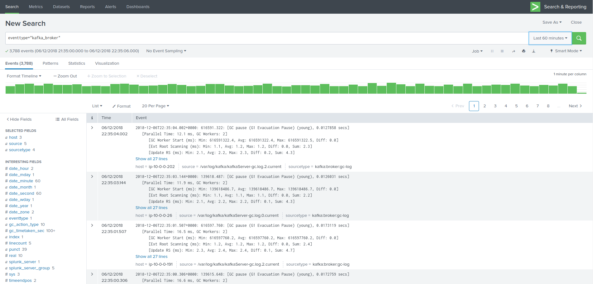
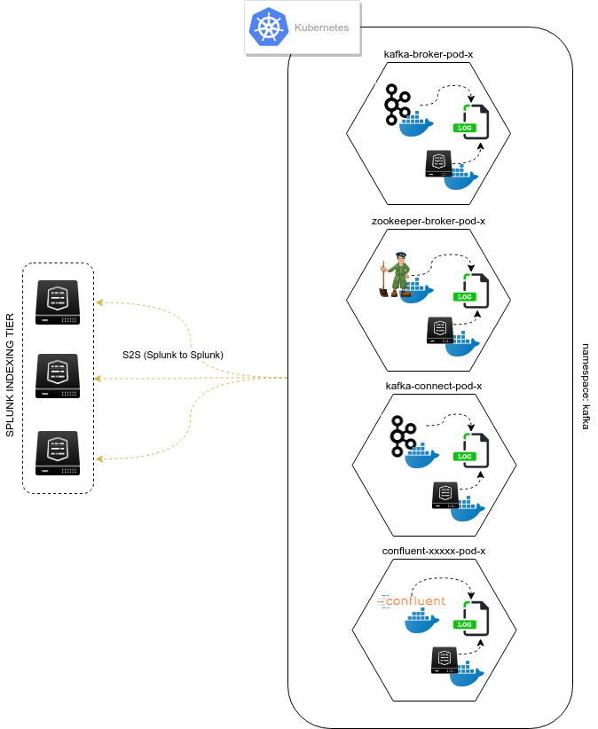

Chapter 1: Events logging
#########################

Pre-requisites
**************

Download the Technology Addon for Technology addon for Kafka streaming platform:

https://splunkbase.splunk.com/app/4302

The full and dedicated documentation site:

https://ta-kafka-streaming-platform.readthedocs.io

Splunk configuration
********************

1. Index creation
=================

Create a new index that will be used to store the events from the whole infrastructure.
By default, the Technology Addon uses an event indexed named ``kafka``.

Ensure that the index was created in your environment before you continue.

You can change the index name by customising the inputs provided by the Splunk application.

2. Deployment of the Technical Addon to the Splunk core infrastructure
======================================================================

**Deploy the Technology Addon to:**

* **The indexers** (cluster master then push the cluster bundle for clusters, as a normal application for a standalone server)
* **Heavy Forwarders** if they are being used as intermediate forwarders before reaching the indexers
* **Search Heads** (SHC deployer if running a search head cluster, as a normal application for a standalone server)
* **Deployment Server** in deployment-apps to be pushed to the Universal Forwarders

Events logging in dedicated servers (bare metal, VMs)
*****************************************************

.. image:: img/dedicated-server.png
   :alt: dedicated-server.png
   :align: center

1. Verify the log4j format in used
==================================

The Technology Addon uses the most optimised configuration to guarantee a proper parsing of the events, specially with a perfect management of multi-line events. (such as Java stacktraces)

**Sourcetype definitions assume the usage of the default format used by Kafka and Confluent Enterprise/OSS**

*Example:*

::

    [2018-11-20 22:02:15,435] INFO Registered kafka:type=kafka.Log4jController MBean (kafka.utils.Log4jControllerRegistration$)

*This relies of your log4j properties files having the following format: (again this is the default format)*

::

    DatePattern='.'yyyy-MM-dd-HH
    layout.ConversionPattern=[%d] %p %m (%c)%n

If you are relying on a different log format, copy the default/props.conf to local/ and achieve the relevant customization.

*Notes: The JVM garbage collector has its own format that is unlikely to be customized*

4. Verify and collect log locations of the Kafka components
===========================================================

As logging directories can be customized, and some components may require some minimal configurations to log properly, you first action is to verify, collect and eventually achieve the required changes.

Apache Kaka - Confluent Enterprise / OSS
========================================

Zookeeper
---------

By default, Confluent may use the same logging location for both Zookeeper and Kafka brokers, suggested configuration to avoid this:

**Configuring the systemd for Zookeeper:**

- Edit: ``/lib/systemd/system/confluent-zookeeper.service``

- Configure the logs location with the LOG_DIR environment variable

::

    [Unit]
    Description=Apache Kafka - ZooKeeper
    Documentation=http://docs.confluent.io/
    After=network.target

    [Service]
    Type=simple
    User=cp-kafka
    Group=confluent
    ExecStart=/usr/bin/zookeeper-server-start /etc/kafka/zookeeper.properties
    Environment="LOG_DIR=/var/log/zookeeper"
    TimeoutStopSec=180
    Restart=no

    [Install]
    WantedBy=multi-user.target

- Create the log directory:

::

    sudo mkdir /var/log/zookeeper
    sudo chown cp-kafka:confluent /var/log/zookeeper

- Restart Zookeeper and verify that logs are properly generated in the directory:

::

    sudo systemctl daemon-reload
    sudo systemctl status confluent-zookeeper

Kafka brokers
-------------

**By default, the Confluent platform generates brokers logs in the following location:**

::

    /var/log/kafka

Kafka Connect
-------------

**Kafka Connect does not log to a file by default, it only logs to the console.**

To change this behaviour, you need to edit the log4j configuration:

**Configuring the systemd service file for Connect:**

- Edit: ``/lib/systemd/system/confluent-kafka-connect.service``

- Configure the logs location with the LOG_DIR environment variable

::

    [Unit]
    Description=Apache Kafka Connect - distributed
    Documentation=http://docs.confluent.io/
    After=network.target confluent-kafka.target

    [Service]
    Type=simple
    User=cp-kafka-connect
    Group=confluent
    ExecStart=/usr/bin/connect-distributed /etc/kafka/connect-distributed.properties
    Environment="LOG_DIR=/var/log/connect"
    TimeoutStopSec=180
    Restart=no

    [Install]
    WantedBy=multi-user.target

- Create the log directory:

::

    sudo mkdir /var/log/connect
    sudo chown cp-kafka-connect:confluent /var/log/connect

**Configuring log4j:**

- Edit: ``/etc/kafka/connect-log4j.properties``

- Add a file appender:

::

    log4j.rootLogger=INFO, stdout, FILE

    log4j.appender.FILE=org.apache.log4j.DailyRollingFileAppender
    log4j.appender.FILE.DatePattern='.'yyyy-MM-dd-HH
    log4j.appender.FILE.File=${kafka.logs.dir}/connect.log
    log4j.appender.FILE.layout=org.apache.log4j.PatternLayout
    log4j.appender.FILE.layout.ConversionPattern=[%d] %p %m (%c)%n

    log4j.appender.stdout=org.apache.log4j.ConsoleAppender
    log4j.appender.stdout.layout=org.apache.log4j.PatternLayout
    log4j.appender.stdout.layout.ConversionPattern=[%d] %p %m (%c:%L)%n

    log4j.logger.org.apache.zookeeper=ERROR
    log4j.logger.org.I0Itec.zkclient=ERROR
    log4j.logger.org.reflections=ERROR

- Restart Connect and verify that the log file is being created:

::

    sudo systemctl daemon-reload
    sudo systemctl restart confluent-kafka-connect

schema-registry
---------------

**By default, the Confluent platform generates Schema registry log in the following location:**

::

    /var/log/confluent/schema-registry

ksql-server
-----------

**ksql-server does not log to a file by default, it only logs to the console.**

Notes: By default, the systemd already defines the log directory location, which should already be existing with the correct permissions.

**Verifying the systemd service file for ksql:**

- Edit: */lib/systemd/system/confluent-ksqldb.service*

- Verify the logs location with the LOG_DIR environment variable

::

    [Unit]
    Description=Streaming SQL engine for Apache Kafka
    Documentation=http://docs.confluent.io/
    After=network.target confluent-kafka.target confluent-schema-registry.target

    [Service]
    Type=simple
    User=cp-ksql
    Group=confluent
    Environment="LOG_DIR=/var/log/confluent/ksql"
    ExecStart=/usr/bin/ksql-server-start /etc/ksqldb/ksql-server.properties
    TimeoutStopSec=180
    Restart=no

    [Install]
    WantedBy=multi-user.target

- Verify and create the log directory if required:

::

    sudo mkdir -p /var/log/confluent/ksql
    sudo chown cp-kafka-connect:confluent /var/log/confluent/ksql

**Configuring log4j:**

- Edit: */etc/ksqldb/log4j.properties*

- Add a file appender:

::

    log4j.rootLogger=INFO, stdout, FILE

    log4j.appender.FILE=org.apache.log4j.DailyRollingFileAppender
    log4j.appender.FILE.DatePattern='.'yyyy-MM-dd-HH
    log4j.appender.FILE.File=${ksql.log.dir}/ksql-server.log
    log4j.appender.FILE.layout=org.apache.log4j.PatternLayout
    log4j.appender.FILE.layout.ConversionPattern=[%d] %p %m (%c)%n

    log4j.appender.stdout=org.apache.log4j.ConsoleAppender
    log4j.appender.stdout.layout=org.apache.log4j.PatternLayout
    log4j.appender.stdout.layout.ConversionPattern=[%d] %p %m (%c:%L)%n

    log4j.appender.streams=org.apache.log4j.ConsoleAppender
    log4j.appender.streams.layout=org.apache.log4j.PatternLayout
    log4j.appender.streams.layout.ConversionPattern=[%d] %p %m (%c:%L)%n

    log4j.logger.kafka=ERROR, stdout
    log4j.logger.org.apache.kafka.streams=INFO, streams
    log4j.additivity.org.apache.kafka.streams=false
    log4j.logger.org.apache.zookeeper=ERROR, stdout
    log4j.logger.org.apache.kafka=ERROR, stdout
    log4j.logger.org.I0Itec.zkclient=ERROR, stdout

- Restart ksql-server and verify that the log file is being created:

::

    sudo systemctl daemon-restart
    sudo systemctl restart confluent-ksqldb

kafka-rest
----------

**By default, the Confluent platform generates kafka-rest logs in the following location:**

::

    /var/log/confluent/kafka-rest

4. Deployment to the Splunk Universal Forwarders
================================================

**This assumes that:**

- You have deployed a Splunk Universal Forwarder (UF) on each instance to be monitored (Zookeeper, brokers, etc)
- UFs are properly configured and forwarding to your Splunk Indexing layer (``index=_internal sourcetype=splunkd`` returns Splunk internal events from the UFs)
- Manage deployment to the UFs via a Splunk Deployment server (although you could use any automation tool of your choice)

**IMPORTANT: By default, all inputs are disabled and must be enabled depending on your needs**

- Extract the content of the Technology Addon archive in your deployment server

*example:*

::

    /opt/splunk/etc/deployment-apps/TA-kafka-streaming-platform

- Create a local directory, copy the default inputs.conf, enable each monitor input required and achieve any customization required, such as custom paths to log directories:

::

    cd /opt/splunk/etc/deployment-apps/TA-kafka-streaming-platform
    mkdir local
    cp -p default/inputs.conf local/

- To enable an input monitor:

*replace*

``disabled = true``

*by*

``disabled = false``

- Finally, create a server class in the deployment server that matches your Kafka infrastructure hosts, associate with the Technology Addon. (ensure to restart splunkd !)

- Once the TA and its configuration has been deployed to the UFs, the logs collection will start immediately.

**Verify**

The easiest and first verification is obviously looking at the index content:

``index=kafka``

Next verification is verifying the eventtypes definition, example:

``eventtype=kafka_broker``

Events logging in Kubernetes and docker containers
**************************************************

.. image:: img/kubernetes-logo.png
   :alt: kubernetes-logo.png
   :align: center

A perfect events logging management requires a different approach in a Kubernetes deployment.

As a basis, each container produces output logging in its standard output, which you can index in Splunk using the Splunk Technical Addon for Kubernetes:

https://splunkbase.splunk.com/app/3991

However, the multi-line management and the differentiation between the different parts of the sub systems logging is a dead end path. (Think about Java stacktraces, garbage collector logging, etc.)

**The approach provided is a different approach that is entirely in the philosophy of Kubernetes and Splunk, by using the Kubernetes pods capabilities:**

- Each Kafka or Confluent container running in a statefulSet or Deployment is updated to produce logs locally on the container (in addition with its standard output)

- A Splunk Universal Forwarder is created and configured to run in the each pod, which is called a sidecar container (running Splunk Forwarders in a container is now fully supported)

- Splunk Universal Forwarders are connected to your Splunk Deployment infrastructure, and managed just as usual

- The containers running in a same pod automatically share the log directory as a volume, Kafka component produces logs, Splunk monitors these

- Anytime the pod is destroyed and re-created, the Splunk containers is automatically re-created and configured

**This is a resilient, scalable and reliable approach that is entirely compatible, relevant and standard with Kubernetes, Kafka and Confluent components, and Splunk.**

*events logging collection diagram - sidecar Splunk Universal Forwarder containers:*

Zookeeper monitoring
====================

Link: `Zookeeper logging`_

.. _Zookeeper logging: https://github.com/guilhemmarchand/splunk-guide-for-kafka-monitoring/tree/master/kubernetes-yaml-examples/zookeeper/01-logging

Kafka Brokers monitoring
========================

Link: `Kafka Brokers logging`_

.. _Kafka Brokers logging: https://github.com/guilhemmarchand/splunk-guide-for-kafka-monitoring/tree/master/kubernetes-yaml-examples/kafka-brokers/01-logging

Kafka Connect monitoring
========================

Link: `Kafka Connect logging`_

.. _Kafka Connect logging: https://github.com/guilhemmarchand/splunk-guide-for-kafka-monitoring/tree/master/kubernetes-yaml-examples/kafka-connect/01-logging

Confluent schema-registry monitoring
====================================

Link: `Confluent shema-registry logging`_

.. _Confluent shema-registry logging: https://github.com/guilhemmarchand/splunk-guide-for-kafka-monitoring/tree/master/kubernetes-yaml-examples/confluent-schema-registry/01-logging

Confluent kafka-rest monitoring
===============================

Link: `Confluent kafka-rest logging`_

.. _Confluent kafka-rest logging: https://github.com/guilhemmarchand/splunk-guide-for-kafka-monitoring/tree/master/kubernetes-yaml-examples/confluent-kafka-rest/01-logging

Confluent ksql-server monitoring
================================

Link: `Confluent ksql-server logging`_

.. _Confluent ksql-server logging: https://github.com/guilhemmarchand/splunk-guide-for-kafka-monitoring/tree/master/kubernetes-yaml-examples/confluent-ksql-server/01-logging
