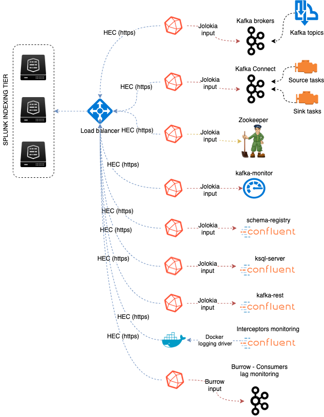
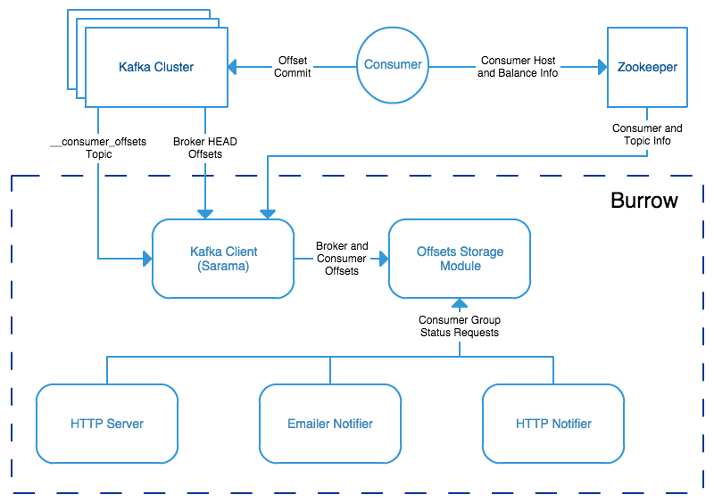

Chapter 2: Metrics
##################

*Data collection diagram overview:*

Splunk configuration
====================

Index definition
----------------

**The application relies by default on the creation of a metrics index called "telegraf_kafka":**

*indexes.conf example with no Splunk volume:*::

   [telegraf_kafka]
   coldPath = $SPLUNK_DB/telegraf_kafka/colddb
   datatype = metric
   homePath = $SPLUNK_DB/telegraf_kafka/db
   thawedPath = $SPLUNK_DB/telegraf_kafka/thaweddb

*indexes.conf example with Splunk volumes:*::

   [telegraf_kafka]
   coldPath = volume:cold/telegraf_kafka/colddb
   datatype = metric
   homePath = volume:primary/telegraf_kafka/db
   thawedPath = $SPLUNK_DB/telegraf_kafka/thaweddb

In a Splunk distributed configuration (cluster of indexers), this configuration stands on the cluster master node.

All Splunk searches included in the added refer to the utilisation of a macro called **"telegraf_kafka_index"** configured in:

* telegraf-kafka/default/macros.conf

If you wish to use a different index model, this macro shall be customized to override the default model.

HEC input ingestion and definition
----------------------------------

**The default recommended way of ingesting the Kafka metrics is using the HTTP Events Collector method which requires the creation of an HEC input.**

*inputs.conf example:*

::

   [http://telegraf_kafka_monitoring]
   disabled = 0
   index = telegraf_kafka
   token = 205d43f1-2a31-4e60-a8b3-327eda49944a

If you create the HEC input via Splunk Web interface, it is not required to select an explicit value for source and sourcetype.

The HEC input will be ideally relying on a load balancer to provides resiliency and load balancing across your HEC input nodes.

Other ingesting methods
-----------------------

**There are other methods possible to ingest the Kafka metrics in Splunk:**

* TCP input (graphite format with tags support)
* KAFKA ingestion (Kafka destination from Telegraf in graphite format with tags support, and Splunk connect for Kafka)
* File monitoring with standard Splunk input monitors (file output plugin from Telegraf)

Notes: In the very specific context of monitoring Kafka, it is not a good design to use Kafka as the ingestion method since you will most likely never be able to know when an issue happens on Kafka.

**These methods require the deployment of an additional Technology addon:** https://splunkbase.splunk.com/app/4193

**These methods are heavily described here:** https://da-itsi-telegraf-os.readthedocs.io/en/latest/telegraf.html

Monitoring Kafka in dedicated servers (bare metal, VMs)
=======================================================

.. image:: img/dedicated-server.png
   :alt: dedicated-server.png
   :align: center

**Dedicated servers are bare metal servers or virtual machines that are dedicated to host one or more Kafka roles.**

Monitoring the components metrics with Telegraf
-----------------------------------------------

.. image:: img/telegraf-logo.png
   :alt: telegraf-logo.png
   :align: center

Telegraf installation, configuration and start
^^^^^^^^^^^^^^^^^^^^^^^^^^^^^^^^^^^^^^^^^^^^^^

**If you are running Telegraf as a regular process in machine, the standard installation of Telegraf is really straightforward, consult:**

- https://github.com/influxdata/telegraf

**If you have a Splunk Universal Forwarder deployment, you can deploy, run and maintain Telegraf and its configuration through a Splunk application (TA), consult:**

- https://da-itsi-telegraf-os.readthedocs.io/en/latest/telegraf.html#telegraf-deployment-as-splunk-application-deployed-by-splunk-ta

An example of a ready to use TA application can be found here:

- https://github.com/guilhemmarchand/TA-telegraf-amd64

For Splunk customers, this solution has various advantages as you can deploy and maintain using your existing Splunk infrastructure.

**Telegraf is extremely container friendly, a container approach is very convenient as you can easily run multiple Telegraf containers to monitor each of the Kafka infrastructure components:**

- https://hub.docker.com/r/_/telegraf/

**Data collection environment design:**

The most scalalable and highly available design in term of where placing the Telegraf instances is to deploy Telegraf locally on each server to be monitored (and collect locally the component) or running as a side car container for Kubernetes based environments.

It is to possible to collect multiple instances of multiple components via a unique Telegraf instance, however there will be a limit where issues can start, and this design will not provide high availability as the failure of this instance will impact the whole metric collection.

Telegraf output configuration
^^^^^^^^^^^^^^^^^^^^^^^^^^^^^

Whether you will be running Telegraf in various containers, or installed as a regular software within the different servers composing your Kafka
infrastructure, a minimal configuration is required to teach Telegraf how to forward the metrics to your Splunk deployment.

**Telegraf is able to send to data to Splunk in different ways:**

* Splunk HTTP Events Collector (HEC) - Since Telegraf v1.8
* Splunk TCP inputs in Graphite format with tags support and the TA for Telegraf
* Apache Kafka topic in Graphite format with tags support and the TA for Telegraf and Splunk connect for Kafka

**Who watches for the watcher?**

As you are running a Kafka deployment, it would seem very logical to produce metrics in a Kafka topic.
However, it presents a specific concern for Kafka itself.

If you use this same system for monitoring Kafka itself, it is very likely that you will never know when Kafka is broken because the data flow for your monitoring system will be broken as well.

The recommendation is to rely either on Splunk HEC or TCP inputs to forward Telegraf metrics data for the Kafka monitoring.

**A minimal configuration for telegraf.conf, running in container or as a regular process in machine and forwarding to HEC:**

::

    [global_tags]
      # the env tag is used by the application for multi-environments management
      env = "my_env"
      # the label tag is an optional tag used by the application that you can use as additional label for the services or infrastructure
      label = "my_env_label"

    [agent]
      interval = "10s"
      flush_interval = "10s"
      hostname = "$HOSTNAME"

    # Regular OS monitoring for Linux OS

    # Read metrics about cpu usage
    [[inputs.cpu]]
      ## Whether to report per-cpu stats or not
      percpu = true
      ## Whether to report total system cpu stats or not
      totalcpu = true
      ## If true, collect raw CPU time metrics.
      collect_cpu_time = false
      ## If true, compute and report the sum of all non-idle CPU states.
      report_active = false

    # Read metrics about disk usage by mount point
    [[inputs.disk]]

      ## Ignore mount points by filesystem type.
      ignore_fs = ["tmpfs", "devtmpfs", "devfs"]

    # Read metrics about disk IO by device
    [[inputs.diskio]]

    # Get kernel statistics from /proc/stat
    [[inputs.kernel]]

    # Read metrics about memory usage
    [[inputs.mem]]

    # Get the number of processes and group them by status
    [[inputs.processes]]

    # Read metrics about swap memory usage
    [[inputs.swap]]

    # Read metrics about system load & uptime
    [[inputs.system]]

    # # Read metrics about network interface usage
    [[inputs.net]]

    # # Read TCP metrics such as established, time wait and sockets counts.
    [[inputs.netstat]]

    # # Monitor process cpu and memory usage
    [[inputs.procstat]]
       pattern = ".*"

    # outputs
    [[outputs.http]]
       url = "https://splunk:8088/services/collector"
       insecure_skip_verify = true
       data_format = "splunkmetric"
        ## Provides time, index, source overrides for the HEC
       splunkmetric_hec_routing = true
        ## Additional HTTP headers
        [outputs.http.headers]
       # Should be set manually to "application/json" for json data_format
          Content-Type = "application/json"
          Authorization = "Splunk 205d43f1-2a31-4e60-a8b3-327eda49944a"
          X-Splunk-Request-Channel = "205d43f1-2a31-4e60-a8b3-327eda49944a"

**If for some reasons, you have to use either of the 2 other solutions, please consult:**

* https://da-itsi-telegraf-os.readthedocs.io/en/latest/telegraf.html

Notes: The configuration above provides out of the box OS monitoring for the hosts, which can be used by the Operating System monitoring application for Splunk:

https://splunkbase.splunk.com/app/4271/

Jolokia JVM monitoring
----------------------

.. image:: img/jolokia_logo.png
   :alt: jolokia_logo.png
   :align: center

**The following Kafka components require Jolokia to be deployed and started, as the modern and efficient interface to JMX that is collected by Telegraf:**

* Apache Kafka Brokers
* Apache Kafka Connect
* Confluent schema-registry
* Confluent ksql-server
* Confluent kafka-rest

**For the complete documentation of Jolokia, see:**

- https://jolokia.org

**Jolokia JVM agent can be started in 2 ways, either as using the -javaagent argument during the start of the JVM, or on the fly by attaching Jolokia to the PID ot the JVM:**

- https://jolokia.org/reference/html/agents.html#agents-jvm

Starting Jolokia with the JVM
^^^^^^^^^^^^^^^^^^^^^^^^^^^^^

**To start Jolokia agent using the -javaagent argument, use such option at the start of the JVM:**

::

    -javaagent:/opt/jolokia/jolokia.jar=port=8778,host=0.0.0.0

*Note: This method is the method used in the docker example within this documentation by using the environment variables of the container.*

**When running on dedicated servers or virtual machines, update the relevant systemd configuration file to start Jolokia automatically:**

For Kafka brokers
"""""""""""""""""

**For bare-metals and dedicated VMs:**

- Edit: ``/lib/systemd/system/confluent-kafka.service``

- Add ``-javaagent`` argument:

::

    [Unit]
    Description=Apache Kafka - broker
    Documentation=http://docs.confluent.io/
    After=network.target confluent-zookeeper.target

    [Service]
    Type=simple
    User=cp-kafka
    Group=confluent
    ExecStart=/usr/bin/kafka-server-start /etc/kafka/server.properties
    Environment="KAFKA_OPTS=-javaagent:/opt/jolokia/jolokia.jar=port=8778,host=0.0.0.0"
    TimeoutStopSec=180
    Restart=no

    [Install]
    WantedBy=multi-user.target

- Reload systemd and restart:

::

    sudo systemctl daemon-restart
    sudo systemctl restart confluent-kafka

**For container based environments:**

*Define the following environment variable when starting the containers:*

::

    KAFKA_OPTS: "-javaagent:/opt/jolokia/jolokia.jar=port=8778,host=0.0.0.0"

For Kafka Connect
"""""""""""""""""

**For bare-metals and dedicated VMs:**

- Edit: ``/lib/systemd/system/confluent-kafka-connect.service``

- Add ``-javaagent`` argument:

::

    [Unit]
    Description=Apache Kafka Connect - distributed
    Documentation=http://docs.confluent.io/
    After=network.target confluent-kafka.target

    [Service]
    Type=simple
    User=cp-kafka-connect
    Group=confluent
    ExecStart=/usr/bin/connect-distributed /etc/kafka/connect-distributed.properties
    Environment="KAFKA_OPTS=-javaagent:/opt/jolokia/jolokia.jar=port=8778,host=0.0.0.0"
    Environment="LOG_DIR=/var/log/connect"
    TimeoutStopSec=180
    Restart=no

    [Install]
    WantedBy=multi-user.target

- Reload systemd and restart:

::

    sudo systemctl daemon-restart
    sudo systemctl restart confluent-kafka-connect

**For container based environments:**

*Define the following environment variable when starting the containers:*

::

    KAFKA_OPTS: "-javaagent:/opt/jolokia/jolokia.jar=port=8778,host=0.0.0.0"

For Confluent schema-registry
"""""""""""""""""""""""""""""

**For bare-metals and dedicated VMs:**

- Edit: ``/lib/systemd/system/confluent-schema-registry.service``

- Add ``-javaagent`` argument:

::

    [Unit]
    Description=RESTful Avro schema registry for Apache Kafka
    Documentation=http://docs.confluent.io/
    After=network.target confluent-kafka.target

    [Service]
    Type=simple
    User=cp-schema-registry
    Group=confluent
    Environment="LOG_DIR=/var/log/confluent/schema-registry"
    Environment="SCHEMA_REGISTRY_OPTS=-javaagent:/opt/jolokia/jolokia.jar=port=8778,host=0.0.0.0"
    ExecStart=/usr/bin/schema-registry-start /etc/schema-registry/schema-registry.properties
    TimeoutStopSec=180
    Restart=no

    [Install]
    WantedBy=multi-user.target

- Reload systemd and restart:

::

    sudo systemctl daemon-restart
    sudo systemctl restart confluent-schema-registry

**For container based environments:**

*Define the following environment variable when starting the containers:*

::

    SCHEMA_REGISTRY_OPTS: "-javaagent:/opt/jolokia/jolokia.jar=port=8778,host=0.0.0.0"

For Confluent ksql-server
"""""""""""""""""""""""""

**For bare-metals and dedicated VMs:**

- Edit: ``/lib/systemd/system/confluent-ksql.service``

- Add ``-javaagent`` argument:

::

    [Unit]
    Description=Streaming SQL engine for Apache Kafka
    Documentation=http://docs.confluent.io/
    After=network.target confluent-kafka.target confluent-schema-registry.target

    [Service]
    Type=simple
    User=cp-ksql
    Group=confluent
    Environment="LOG_DIR=/var/log/confluent/ksql"
    Environment="KSQL_OPTS=-javaagent:/opt/jolokia/jolokia.jar=port=8778,host=0.0.0.0"
    ExecStart=/usr/bin/ksql-server-start /etc/ksql/ksql-server.properties
    TimeoutStopSec=180
    Restart=no

    [Install]
    WantedBy=multi-user.target

- Reload systemd and restart:

::

    sudo systemctl daemon-restart
    sudo systemctl restart confluent-ksql

**For container based environments:**

*Define the following environment variable when starting the containers:*

::

    KSQL_OPTS: "-javaagent:/opt/jolokia/jolokia.jar=port=8778,host=0.0.0.0"

For Confluent kafka-rest
""""""""""""""""""""""""

**For bare-metals and dedicated VMs:**

- Edit: ``/lib/systemd/system/confluent-kafka-rest.service``

- Add ``-javaagent`` argument:

::

    [Unit]
    Description=A REST proxy for Apache Kafka
    Documentation=http://docs.confluent.io/
    After=network.target confluent-kafka.target

    [Service]
    Type=simple
    User=cp-kafka-rest
    Group=confluent
    Environment="LOG_DIR=/var/log/confluent/kafka-rest"
    Environment="KAFKAREST_OPTS=-javaagent:/opt/jolokia/jolokia.jar=port=8778,host=0.0.0.0"

    ExecStart=/usr/bin/kafka-rest-start /etc/kafka-rest/kafka-rest.properties
    TimeoutStopSec=180
    Restart=no

    [Install]
    WantedBy=multi-user.target

- Reload systemd and restart:

::

    sudo systemctl daemon-restart
    sudo systemctl restart confluent-kafka-rest

**For container based environments:**

*Define the following environment variable when starting the containers:*

::

    KAFKAREST_OPTS: "-javaagent:/opt/jolokia/jolokia.jar=port=8778,host=0.0.0.0"

Notes: "KAFKAREST_OPTS" is not a typo, this is the real name of the environment variable for some reason.

Starting Jolokia on the fly
"""""""""""""""""""""""""""

**To attach Jolokia agent to an existing JVM, identify its process ID (PID), simplistic example:**

::

    ps -ef | grep 'kafka.properties' | grep -v grep | awk '{print $1}'

**Then:**

::

    java -jar /opt/jolokia/jolokia.jar --host 0.0.0.0 --port 8778 start <PID>

*Add this operation to any custom init scripts you use to start the Kafka components.*

Zookeeper monitoring
--------------------

Collecting with Telegraf
^^^^^^^^^^^^^^^^^^^^^^^^

The Zookeeper monitoring is very simple and achieved by Telegraf and the Zookeeper input plugin.

**The following configuration stands in telegraf.conf and configures the input plugin to monitor multiple Zookeeper servers from one source:**

::

    # zookeeper metrics
    [[inputs.zookeeper]]
      servers = ["zookeeper-1:12181","zookeeper-2:22181","zookeeper-3:32181"]

**If each server runs an instance of Zookeeper and you deploy Telegraf, you can simply collect from the localhost:**

::

    # zookeeper metrics
    [[inputs.zookeeper]]
      servers = ["$HOSTNAME:2181"]

Full telegraf.conf example
^^^^^^^^^^^^^^^^^^^^^^^^^^

*The following telegraf.conf collects a cluster of 3 Zookeeper servers:*

::

   [global_tags]
     # the env tag is used by the application for multi-environments management
     env = "my_env"
     # the label tag is an optional tag used by the application that you can use as additional label for the services or infrastructure
     label = "my_env_label"

   [agent]
     interval = "10s"
     flush_interval = "10s"
     hostname = "$HOSTNAME"

   # outputs
   [[outputs.http]]
      url = "https://splunk:8088/services/collector"
      insecure_skip_verify = true
      data_format = "splunkmetric"
       ## Provides time, index, source overrides for the HEC
      splunkmetric_hec_routing = true
       ## Additional HTTP headers
       [outputs.http.headers]
      # Should be set manually to "application/json" for json data_format
         Content-Type = "application/json"
         Authorization = "Splunk 205d43f1-2a31-4e60-a8b3-327eda49944a"
         X-Splunk-Request-Channel = "205d43f1-2a31-4e60-a8b3-327eda49944a"

   # zookeeper metrics
   [[inputs.zookeeper]]
     servers = ["zookeeper-1:12181","zookeeper-2:22181","zookeeper-3:32181"]

**Using mcatalog search command to verify data availability:**

::

    | mcatalog values(metric_name) values(_dims) where index=* metric_name=zookeeper.*

Kafka brokers monitoring with Jolokia
-------------------------------------

Collecting with Telegraf
^^^^^^^^^^^^^^^^^^^^^^^^

Depending on how you run Kafka and your architecture preferences, you may prefer to collect all the brokers metrics from one Telegraf collector, or installed locally on the Kafka brocker machine.

**Connecting to multiple remote Jolokia instances:**

::

    # Kafka JVM monitoring
    [[inputs.jolokia2_agent]]
      name_prefix = "kafka_"
      urls = ["http://kafka-1:18778/jolokia","http://kafka-2:28778/jolokia","http://kafka-3:38778/jolokia"]

**Connecting to the local Jolokia instance:**

::

    # Kafka JVM monitoring
    [[inputs.jolokia2_agent]]
      name_prefix = "kafka_"
      urls = ["http://$HOSTNAME:8778/jolokia"]

Full telegraf.conf example
^^^^^^^^^^^^^^^^^^^^^^^^^^

*The following telegraf.conf collects a cluster of 3 Kafka brokers:*

::

    [global_tags]
      # the env tag is used by the application for multi-environments management
      env = "my_env"
      # the label tag is an optional tag used by the application that you can use as additional label for the services or infrastructure
      label = "my_env_label"

    [agent]
      interval = "10s"
      flush_interval = "10s"
      hostname = "$HOSTNAME"

    # outputs
    [[outputs.http]]
       url = "https://splunk:8088/services/collector"
       insecure_skip_verify = true
       data_format = "splunkmetric"
        ## Provides time, index, source overrides for the HEC
       splunkmetric_hec_routing = true
        ## Additional HTTP headers
        [outputs.http.headers]
       # Should be set manually to "application/json" for json data_format
          Content-Type = "application/json"
          Authorization = "Splunk 205d43f1-2a31-4e60-a8b3-327eda49944a"
          X-Splunk-Request-Channel = "205d43f1-2a31-4e60-a8b3-327eda49944a"

    # Kafka JVM monitoring

    [[inputs.jolokia2_agent]]
      name_prefix = "kafka_"
      urls = ["http://kafka-1:18778/jolokia","http://kafka-2:28778/jolokia","http://kafka-3:38778/jolokia"]

    [[inputs.jolokia2_agent.metric]]
      name         = "controller"
      mbean        = "kafka.controller:name=*,type=*"
      field_prefix = "$1."

    [[inputs.jolokia2_agent.metric]]
      name         = "replica_manager"
      mbean        = "kafka.server:name=*,type=ReplicaManager"
      field_prefix = "$1."

    [[inputs.jolokia2_agent.metric]]
      name         = "purgatory"
      mbean        = "kafka.server:delayedOperation=*,name=*,type=DelayedOperationPurgatory"
      field_prefix = "$1."
      field_name   = "$2"

    [[inputs.jolokia2_agent.metric]]
      name     = "client"
      mbean    = "kafka.server:client-id=*,type=*"
      tag_keys = ["client-id", "type"]

    [[inputs.jolokia2_agent.metric]]
      name         = "network"
      mbean        = "kafka.network:name=*,request=*,type=RequestMetrics"
      field_prefix = "$1."
      tag_keys     = ["request"]

    [[inputs.jolokia2_agent.metric]]
      name         = "network"
      mbean        = "kafka.network:name=ResponseQueueSize,type=RequestChannel"
      field_prefix = "ResponseQueueSize"
      tag_keys     = ["name"]

    [[inputs.jolokia2_agent.metric]]
      name         = "network"
      mbean        = "kafka.network:name=NetworkProcessorAvgIdlePercent,type=SocketServer"
      field_prefix = "NetworkProcessorAvgIdlePercent"
      tag_keys     = ["name"]

    [[inputs.jolokia2_agent.metric]]
      name         = "topics"
      mbean        = "kafka.server:name=*,type=BrokerTopicMetrics"
      field_prefix = "$1."

    [[inputs.jolokia2_agent.metric]]
      name         = "topic"
      mbean        = "kafka.server:name=*,topic=*,type=BrokerTopicMetrics"
      field_prefix = "$1."
      tag_keys     = ["topic"]

    [[inputs.jolokia2_agent.metric]]
      name       = "partition"
      mbean      = "kafka.log:name=*,partition=*,topic=*,type=Log"
      field_name = "$1"
      tag_keys   = ["topic", "partition"]

    [[inputs.jolokia2_agent.metric]]
      name       = "log"
      mbean      = "kafka.log:name=LogFlushRateAndTimeMs,type=LogFlushStats"
      field_name = "LogFlushRateAndTimeMs"
      tag_keys   = ["name"]

    [[inputs.jolokia2_agent.metric]]
      name       = "partition"
      mbean      = "kafka.cluster:name=UnderReplicated,partition=*,topic=*,type=Partition"
      field_name = "UnderReplicatedPartitions"
      tag_keys   = ["topic", "partition"]

    [[inputs.jolokia2_agent.metric]]
      name     = "request_handlers"
      mbean    = "kafka.server:name=RequestHandlerAvgIdlePercent,type=KafkaRequestHandlerPool"
      tag_keys = ["name"]

    # JVM garbage collector monitoring
    [[inputs.jolokia2_agent.metric]]
      name     = "jvm_garbage_collector"
      mbean    = "java.lang:name=*,type=GarbageCollector"
      paths    = ["CollectionTime", "CollectionCount", "LastGcInfo"]
      tag_keys = ["name"]

**Using mcatalog search command to verify data availability:**

::

    | mcatalog values(metric_name) values(_dims) where index=* metric_name=kafka_*.*

Kafka connect monitoring
------------------------

Collecting with Telegraf
^^^^^^^^^^^^^^^^^^^^^^^^

**Connecting to multiple remote Jolokia instances:**

::

   # Kafka-connect JVM monitoring
   [[inputs.jolokia2_agent]]
     name_prefix = "kafka_connect."
     urls = ["http://kafka-connect-1:18779/jolokia","http://kafka-connect-2:28779/jolokia","http://kafka-connect-3:38779/jolokia"]

**Connecting to local Jolokia instance:**

::

   # Kafka-connect JVM monitoring
    [[inputs.jolokia2_agent]]
      name_prefix = "kafka_connect."
      urls = ["http://$HOSTNAME:8778/jolokia"]

Full telegraf.conf example
^^^^^^^^^^^^^^^^^^^^^^^^^^

*bellow a full telegraf.conf example:*

::

   [global_tags]
     # the env tag is used by the application for multi-environments management
     env = "my_env"
     # the label tag is an optional tag used by the application that you can use as additional label for the services or infrastructure
     label = "my_env_label"

   [agent]
     interval = "10s"
     flush_interval = "10s"
     hostname = "$HOSTNAME"

   # outputs
   [[outputs.http]]
      url = "https://splunk:8088/services/collector"
      insecure_skip_verify = true
      data_format = "splunkmetric"
       ## Provides time, index, source overrides for the HEC
      splunkmetric_hec_routing = true
       ## Additional HTTP headers
       [outputs.http.headers]
      # Should be set manually to "application/json" for json data_format
         Content-Type = "application/json"
         Authorization = "Splunk 205d43f1-2a31-4e60-a8b3-327eda49944a"
         X-Splunk-Request-Channel = "205d43f1-2a31-4e60-a8b3-327eda49944a"

   # Kafka-connect JVM monitoring

   [[inputs.jolokia2_agent]]
     name_prefix = "kafka_connect."
     urls = ["http://kafka-connect-1:18779/jolokia","http://kafka-connect-2:28779/jolokia","http://kafka-connect-3:38779/jolokia"]

   [[inputs.jolokia2_agent.metric]]
     name         = "worker"
     mbean        = "kafka.connect:type=connect-worker-metrics"

   [[inputs.jolokia2_agent.metric]]
     name         = "worker"
     mbean        = "kafka.connect:type=connect-worker-rebalance-metrics"

   [[inputs.jolokia2_agent.metric]]
     name         = "connector-task"
     mbean        = "kafka.connect:type=connector-task-metrics,connector=*,task=*"
     tag_keys = ["connector", "task"]

   [[inputs.jolokia2_agent.metric]]
     name         = "sink-task"
     mbean        = "kafka.connect:type=sink-task-metrics,connector=*,task=*"
     tag_keys = ["connector", "task"]

   [[inputs.jolokia2_agent.metric]]
     name         = "source-task"
     mbean        = "kafka.connect:type=source-task-metrics,connector=*,task=*"
     tag_keys = ["connector", "task"]

   [[inputs.jolokia2_agent.metric]]
     name         = "error-task"
     mbean        = "kafka.connect:type=task-error-metrics,connector=*,task=*"
     tag_keys = ["connector", "task"]

   # Kafka connect return a status value which is non numerical
   # Using the enum processor with the following configuration replaces the string value by our mapping
   [[processors.enum]]
     [[processors.enum.mapping]]
       ## Name of the field to map
       field = "status"

       ## Table of mappings
       [processors.enum.mapping.value_mappings]
         paused = 0
         running = 1
         unassigned = 2
         failed = 3
         destroyed = 4

**Using mcatalog search command to verify data availability:**

::

    | mcatalog values(metric_name) values(_dims) where index=* metric_name=kafka_connect.*

Kafka LinkedIn monitor - end to end monitoring
----------------------------------------------

Installing and starting the Kafka monitor
^^^^^^^^^^^^^^^^^^^^^^^^^^^^^^^^^^^^^^^^^

**LinkedIn provides an extremely powerful open source end to end monitoring solution for Kafka, please consult:**

* https://github.com/linkedin/kafka-monitor

As a builtin configuration, the kafka-monitor implements a jolokia agent, so collecting the metrics with Telegraf cannot be more easy !

**It is very straightforward to run the kafka-monitor in a docker container, first you need to create your own image:**

* https://github.com/linkedin/kafka-monitor/tree/master/docker

**Once your Kafka monitor is running, you need a Telegraf instance that will be collecting the JMX beans, example:**

::

    [global_tags]
      # the env tag is used by the application for multi-environments management
      env = "my_env"
      # the label tag is an optional tag used by the application that you can use as additional label for the services or infrastructure
      label = "my_env_label"

    [agent]
      interval = "10s"
      flush_interval = "10s"
      hostname = "$HOSTNAME"

    # outputs
    [[outputs.http]]
       url = "https://splunk:8088/services/collector"
       insecure_skip_verify = true
       data_format = "splunkmetric"
        ## Provides time, index, source overrides for the HEC
       splunkmetric_hec_routing = true
        ## Additional HTTP headers
        [outputs.http.headers]
       # Should be set manually to "application/json" for json data_format
          Content-Type = "application/json"
          Authorization = "Splunk 205d43f1-2a31-4e60-a8b3-327eda49944a"
          X-Splunk-Request-Channel = "205d43f1-2a31-4e60-a8b3-327eda49944a"

    # Kafka JVM monitoring

    [[inputs.jolokia2_agent]]
      name_prefix = "kafka_"
      urls = ["http://kafka-monitor:8778/jolokia"]

    [[inputs.jolokia2_agent.metric]]
      name         = "kafka-monitor"
      mbean        = "kmf.services:name=*,type=*"

**Using mcatalog search command to verify data availability:**

::

    | mcatalog values(metric_name) values(_dims) where index=* metric_name=kafka_kafka-monitor.*

Confluent schema-registry
-------------------------

Collecting with Telegraf
^^^^^^^^^^^^^^^^^^^^^^^^

**Connecting to multiple remote Jolokia instances:**

::

   [[inputs.jolokia2_agent]]
     name_prefix = "kafka_schema-registry."
     urls = ["http://schema-registry:18783/jolokia"]

**Connecting to local Jolokia instance:**

::

   # Kafka-connect JVM monitoring
    [[inputs.jolokia2_agent]]
     name_prefix = "kafka_schema-registry."
      urls = ["http://$HOSTNAME:8778/jolokia"]

Full telegraf.conf example
^^^^^^^^^^^^^^^^^^^^^^^^^^

*bellow a full telegraf.conf example:*

::

   [global_tags]
     # the env tag is used by the application for multi-environments management
     env = "my_env"
     # the label tag is an optional tag used by the application that you can use as additional label for the services or infrastructure
     label = "my_env_label"

   [agent]
     interval = "10s"
     flush_interval = "10s"
     hostname = "$HOSTNAME"

   # outputs
   [[outputs.http]]
      url = "https://splunk:8088/services/collector"
      insecure_skip_verify = true
      data_format = "splunkmetric"
       ## Provides time, index, source overrides for the HEC
      splunkmetric_hec_routing = true
       ## Additional HTTP headers
       [outputs.http.headers]
      # Should be set manually to "application/json" for json data_format
         Content-Type = "application/json"
         Authorization = "Splunk 205d43f1-2a31-4e60-a8b3-327eda49944a"
         X-Splunk-Request-Channel = "205d43f1-2a31-4e60-a8b3-327eda49944a"

   # schema-registry JVM monitoring

   [[inputs.jolokia2_agent]]
     name_prefix = "kafka_schema-registry."
     urls = ["http://schema-registry:18783/jolokia"]

   [[inputs.jolokia2_agent.metric]]
     name         = "jetty-metrics"
     mbean        = "kafka.schema.registry:type=jetty-metrics"
     paths = ["connections-active", "connections-opened-rate", "connections-closed-rate"]

   [[inputs.jolokia2_agent.metric]]
     name         = "master-slave-role"
     mbean        = "kafka.schema.registry:type=master-slave-role"

   [[inputs.jolokia2_agent.metric]]
     name         = "jersey-metrics"
     mbean        = "kafka.schema.registry:type=jersey-metrics"

**Using mcatalog search command to verify data availability:**

::

    | mcatalog values(metric_name) values(_dims) where index=* metric_name=kafka_schema-registry.*

Confluent ksql-server
---------------------

Collecting with Telegraf
^^^^^^^^^^^^^^^^^^^^^^^^

**Connecting to multiple remote Jolokia instances:**

::

    [[inputs.jolokia2_agent]]
      name_prefix = "kafka_"
      urls = ["http://ksql-server-1:18784/jolokia"]

**Connecting to local Jolokia instance:**

::

    [[inputs.jolokia2_agent]]
      name_prefix = "kafka_"
      urls = ["http://$HOSTNAME:18784/jolokia"]

Full telegraf.conf example
^^^^^^^^^^^^^^^^^^^^^^^^^^

*bellow a full telegraf.conf example:*

::

   [global_tags]
     # the env tag is used by the application for multi-environments management
     env = "my_env"
     # the label tag is an optional tag used by the application that you can use as additional label for the services or infrastructure
     label = "my_env_label"

   [agent]
     interval = "10s"
     flush_interval = "10s"
     hostname = "$HOSTNAME"

   # outputs
   [[outputs.http]]
      url = "https://splunk:8088/services/collector"
      insecure_skip_verify = true
      data_format = "splunkmetric"
       ## Provides time, index, source overrides for the HEC
      splunkmetric_hec_routing = true
       ## Additional HTTP headers
       [outputs.http.headers]
      # Should be set manually to "application/json" for json data_format
         Content-Type = "application/json"
         Authorization = "Splunk 205d43f1-2a31-4e60-a8b3-327eda49944a"
         X-Splunk-Request-Channel = "205d43f1-2a31-4e60-a8b3-327eda49944a"

   # ksql-server JVM monitoring

    [[inputs.jolokia2_agent]]
      name_prefix = "kafka_"
      urls = ["http://ksql-server:18784/jolokia"]

    [[inputs.jolokia2_agent.metric]]
      name         = "ksql-server"
      mbean        = "io.confluent.ksql.metrics:type=*"

**Using mcatalog search command to verify data availability:**

::

    | mcatalog values(metric_name) values(_dims) where index=* metric_name=kafka_ksql-server.*

Confluent kafka-rest
--------------------

Collecting with Telegraf
^^^^^^^^^^^^^^^^^^^^^^^^

**Connecting to multiple remote Jolokia instances:**

::

    [[inputs.jolokia2_agent]]
      name_prefix = "kafka_kafka-rest."
      urls = ["http://kafka-rest:8778/jolokia"]

**Connecting to local Jolokia instance:**

::

    [[inputs.jolokia2_agent]]
      name_prefix = "kafka_kafka-rest."
      urls = ["http://$HOSTNAME:18785/jolokia"]

Full telegraf.conf example
^^^^^^^^^^^^^^^^^^^^^^^^^^

*bellow a full telegraf.conf example:*

::

   [global_tags]
     # the env tag is used by the application for multi-environments management
     env = "my_env"
     # the label tag is an optional tag used by the application that you can use as additional label for the services or infrastructure
     label = "my_env_label"

   [agent]
     interval = "10s"
     flush_interval = "10s"
     hostname = "$HOSTNAME"

   # outputs
   [[outputs.http]]
      url = "https://splunk:8088/services/collector"
      insecure_skip_verify = true
      data_format = "splunkmetric"
       ## Provides time, index, source overrides for the HEC
      splunkmetric_hec_routing = true
       ## Additional HTTP headers
       [outputs.http.headers]
      # Should be set manually to "application/json" for json data_format
         Content-Type = "application/json"
         Authorization = "Splunk 205d43f1-2a31-4e60-a8b3-327eda49944a"
         X-Splunk-Request-Channel = "205d43f1-2a31-4e60-a8b3-327eda49944a"

    # kafka-rest JVM monitoring

    [[inputs.jolokia2_agent]]
      name_prefix = "kafka_kafka-rest."
      urls = ["http://kafka-rest:18785/jolokia"]

    [[inputs.jolokia2_agent.metric]]
      name         = "jetty-metrics"
      mbean        = "kafka.rest:type=jetty-metrics"
      paths = ["connections-active", "connections-opened-rate", "connections-closed-rate"]

    [[inputs.jolokia2_agent.metric]]
      name         = "jersey-metrics"
      mbean        = "kafka.rest:type=jersey-metrics"

**Using mcatalog search command to verify data availability:**

::

    | mcatalog values(metric_name) values(_dims) where index=* metric_name=kafka_kafka_kafka-rest.*

Burrow Lag Consumers
--------------------

**As from their authors, Burrow is a monitoring companion for Apache Kafka that provides consumer lag checking as a service without the need for specifying thresholds.**

See: https://github.com/linkedin/Burrow

*Burrow workflow diagram:*

**Burrow is a very powerful application that monitors all consumers (Kafka Connect connectors, Kafka Streams...) to report an advanced state of the service automatically, and various useful lagging metrics.**

**Telegraf has a native input for Burrow which polls consumers, topics and partitions lag metrics and statuses over http, use the following telegraf minimal configuration:**

See: https://github.com/influxdata/telegraf/tree/master/plugins/inputs/burrow

::

    [global_tags]
      # the env tag is used by the application for multi-environments management
      env = "my_env"
      # the label tag is an optional tag used by the application that you can use as additional label for the services or infrastructure
      label = "my_env_label"

    [agent]
      interval = "10s"
      flush_interval = "10s"
      hostname = "$HOSTNAME"

    # outputs
    [[outputs.http]]
       url = "https://splunk:8088/services/collector"
       insecure_skip_verify = true
       data_format = "splunkmetric"
        ## Provides time, index, source overrides for the HEC
       splunkmetric_hec_routing = true
        ## Additional HTTP headers
        [outputs.http.headers]
       # Should be set manually to "application/json" for json data_format
          Content-Type = "application/json"
          Authorization = "Splunk 205d43f1-2a31-4e60-a8b3-327eda49944a"
          X-Splunk-Request-Channel = "205d43f1-2a31-4e60-a8b3-327eda49944a"

    # Burrow

    [[inputs.burrow]]
      ## Burrow API endpoints in format "schema://host:port".
      ## Default is "http://localhost:8000".
      servers = ["http://dockerhost:9001"]

      ## Override Burrow API prefix.
      ## Useful when Burrow is behind reverse-proxy.
      # api_prefix = "/v3/kafka"

      ## Maximum time to receive response.
      # response_timeout = "5s"

      ## Limit per-server concurrent connections.
      ## Useful in case of large number of topics or consumer groups.
      # concurrent_connections = 20

      ## Filter clusters, default is no filtering.
      ## Values can be specified as glob patterns.
      # clusters_include = []
      # clusters_exclude = []

      ## Filter consumer groups, default is no filtering.
      ## Values can be specified as glob patterns.
      # groups_include = []
      # groups_exclude = []

      ## Filter topics, default is no filtering.
      ## Values can be specified as glob patterns.
      # topics_include = []
      # topics_exclude = []

      ## Credentials for basic HTTP authentication.
      # username = ""
      # password = ""

      ## Optional SSL config
      # ssl_ca = "/etc/telegraf/ca.pem"
      # ssl_cert = "/etc/telegraf/cert.pem"
      # ssl_key = "/etc/telegraf/key.pem"
      # insecure_skip_verify = false

**Using mcatalog search command to verify data availability:**

::

    | mcatalog values(metric_name) values(_dims) where index=* metric_name=burrow_*

Monitoring Kafka in Kubernetes
==============================

.. image:: img/kubernetes-logo.png
   :alt: kubernetes-logo.png
   :align: center

**For the ease of documentation, this guide assumes you are deploying containers with Kubernetes and Docker, although these instructions can transposed to other containers orchestrator solutions.**

**3 main steps for implementation:**

1. Deploying Jolokia jar agent
2. Configuring the containers to start with Jolokia
3. Deploying the Telegraf containers

*metrics collection diagram - sidecar containers:*

.. image:: img/draw.io/k8s-metrics.png
   :alt: k8s-metrics.png
   :align: center

Deploying Jolokia
-----------------

.. image:: img/jolokia_logo.png
   :alt: jolokia_logo.png
   :align: center

**The Jolokia agent jar file needs to be available to the pods, you have different possibilities:**

- Starting Kubernetes 1.10.0, you can store a binary file in a configMap. As such, it is very easy to load the Jolokia jar file and make it available to your pods. (**recommended approach**)

- For prior versions, you can automatically mount a persistent volume on the pods such as an NFS volume or a Cloud provider volume that will make the Jolokia jar available to your pods.

- uploading the jar file on every node and mounting a local persistent volume (requires each node to have the jolokia jar uploaded manually)

**To download the latest version of Jolokia:** https://jolokia.org/reference/html/agents.html#agents-jvm

Option 1: Jolokia jar in configMap
^^^^^^^^^^^^^^^^^^^^^^^^^^^^^^^^^^

**See the files in Github:**

https://github.com/guilhemmarchand/splunk-guide-for-kafka-monitoring/tree/master/kubernetes-yaml-examples/Jolokia

**From your management server where kubectl is configured, download the latest Jolokia jar file:**

::

    curl http://search.maven.org/remotecontent?filepath=org/jolokia/jolokia-jvm/1.6.0/jolokia-jvm-1.6.0-agent.jar -o jolokia.jar

**Create a configMap from the binary file:**

::

    kubectl create configmap jolokia-jar --from-file=jolokia.jar

**From the configMap, optionally create the yml file:**

::

    kubectl get configmaps jolokia-jar -o yaml --export > 01-jolokia-jar-configmap.yml

**If you need your configMap to be associated with a name space, simply edit the end of the file and add your name space Metadata:**

::

    metadata:
      name: jolokia-jar
      namespace: kafka

**Modify your definitions to include the volume:**

::

    spec:
      volumes:
        - name: jolokia-jar
          configMap:
            name: jolokia-jar
      containers:
        - name: xxxxx
          image: xxxx
          volumeMounts:
            - mountPath: "/opt/jolokia"
              name: jolokia-jar

**Finally, update the environment variable to start Jolokia (see next steps) and apply.**

Option 2: NFS persistent volume configuration example
^^^^^^^^^^^^^^^^^^^^^^^^^^^^^^^^^^^^^^^^^^^^^^^^^^^^^

**Ensure all the nodes have the nfs-common package installed:**

*For Ubuntu & Debian:*

::

    sudo apt-get -y install nfs-common

*For RHEL, Centos and derivated:*

::

    sudo yum -y install nfs-common

**Upload the jar file to your NFS server, and create a share that will be used automatically by the pods, example:**

::

    /export/jolokia/jolokia-jvm-1.6.0-agent.jar

**Have your share configured in /etc/exports:**

::

    /export/jolokia/ *(ro,sync,no_root_squash,subtree_check)

**Refresh exports:**

::

    sudo exportfs -ra

**Create a Kubernetes PersistentVolume:**

*pv-jolokia.yaml*

::

    kind: PersistentVolume
    apiVersion: v1
    metadata:
      name: pv-jolokia
      labels:
        type: jolokia
    spec:
      storageClassName: generic
      capacity:
        storage: 100Mi
      accessModes:
        - ReadOnlyMany
      persistentVolumeReclaimPolicy: Retain
      nfs:
        path: /export/jolokia
        server: <NFS server address>
        readOnly: true

*pvc-jolokia.yaml:**

::

    apiVersion: v1
    kind: PersistentVolumeClaim
    metadata:
      name: pvc-jolokia
    spec:
      storageClassName: generic
      accessModes:
      - ReadOnlyMany
      resources:
        requests:
          storage: 100Mi
      selector:
        matchLabels:
          type: jolokia

**When you will start your pods, you will specify the PersistentVolumeClaim and the mount options to get Jolokia available on the pods:**

::

    kind: Pod
    apiVersion: v1
    metadata:
      name: xxxxx
    spec:
      volumes:
        - name: pv-jolokia
          persistentVolumeClaim:
           claimName: pvc-jolokia
      containers:
        - name: xxxxx
          image: xxxx
          volumeMounts:
            - mountPath: "/opt/jolokia"
              name: pv-jolokia

Option 3: Local persistent volume configuration example
^^^^^^^^^^^^^^^^^^^^^^^^^^^^^^^^^^^^^^^^^^^^^^^^^^^^^^^

**Upload the jar file to each of Kubernetes node, this documentation assumes the agent will be available in /opt/jolokia/, example:**

::

    /opt/jolokia/jolokia-jvm-1.6.0-agent.jar

**Create a Kubernetes PersistentVolume:**

*pv-jolokia.yaml*

::

    kind: PersistentVolume
    apiVersion: v1
    metadata:
      name: pv-jolokia
      labels:
        type: jolokia
    spec:
      storageClassName: generic
      capacity:
        storage: 100Mi
      accessModes:
        - ReadOnlyMany
      persistentVolumeReclaimPolicy: Retain
      hostPath:
        path: "/opt/jolokia"

**Create:**

::

    kubectl create -f pv-jolokia.yaml

**Create a PersistentVolumeClaim to be used by the pods definition:**

*pvc-jolokia.yaml:**

::

        apiVersion: v1
        kind: PersistentVolumeClaim
        metadata:
          name: pvc-jolokia
        spec:
          storageClassName: generic
          accessModes:
          - ReadOnlyMany
          resources:
            requests:
              storage: 100Mi
          selector:
            matchLabels:
              type: jolokia

**When you will start your pods, you will specify the PersistentVolumeClaim and the mount options to get Jolokia available on the pods:**

::

    kind: Pod
    apiVersion: v1
    metadata:
      name: xxxxx
    spec:
      volumes:
        - name: pv-jolokia
          persistentVolumeClaim:
           claimName: pvc-jolokia
      containers:
        - name: xxxxx
          image: xxxx
          volumeMounts:
            - mountPath: "/opt/jolokia"
              name: pv-jolokia

Starting Jolokia with container startup
---------------------------------------

Kafka brokers
^^^^^^^^^^^^^

**Modify your pod definition:**

::

    spec:
      containers:
      - name: xxxxxx
        image: xxxxxx:latest
        env:
        - name: KAFKA_OPTS
          value: "-javaagent:/opt/jolokia/jolokia.jar=port=8778,host=0.0.0.0"

**You can use the patch method to update your existing pod definition:**

https://github.com/guilhemmarchand/splunk-guide-for-kafka-monitoring/tree/master/kubernetes-yaml-examples/zookeeper

Kafka Connect
^^^^^^^^^^^^^

**Modify your pod definition:**

::

    spec:
      containers:
      - name: xxxxxx
        image: xxxxxx:latest
        env:
        - name: KAFKA_OPTS
          value: "-javaagent:/opt/jolokia/jolokia.jar=port=8778,host=0.0.0.0"

**You can use the patch method to update your existing pod definition:**

https://github.com/guilhemmarchand/splunk-guide-for-kafka-monitoring/tree/master/kubernetes-yaml-examples/kafka-connect

Schema registry
^^^^^^^^^^^^^^^

**Modify your pod definition:**

::

    spec:
      containers:
      - name: xxxxxx
        image: xxxxxx:latest
        env:
        - name: SCHEMA_REGISTRY_OPTS
          value: "-javaagent:/opt/jolokia/jolokia.jar=port=8778,host=0.0.0.0"

**You can use the patch method to update your existing pod definition:**

https://github.com/guilhemmarchand/splunk-guide-for-kafka-monitoring/tree/master/kubernetes-yaml-examples/confluent-schema-registry

ksql-server
^^^^^^^^^^^

**Modify your pod definition:**

::

    spec:
      containers:
      - name: xxxxxx
        image: xxxxxx:latest
        env:
        - name: KSQL_OPTS
          value: "-javaagent:/opt/jolokia/jolokia.jar=port=8778,host=0.0.0.0"

**You can use the patch method to update your existing pod definition:**

https://github.com/guilhemmarchand/splunk-guide-for-kafka-monitoring/tree/master/kubernetes-yaml-examples/confluent-ksql-server

kafka-rest
^^^^^^^^^^

**Modify your pod definition:**

::

    spec:
      containers:
      - name: xxxxxx
        image: xxxxxx:latest
        env:
        - name: KAFKAREST_OPTS
          value: "-javaagent:/opt/jolokia/jolokia.jar=port=8778,host=0.0.0.0"

**You can use the patch method to update your existing pod definition:**

https://github.com/guilhemmarchand/splunk-guide-for-kafka-monitoring/tree/master/kubernetes-yaml-examples/confluent-kafka-rest

Monitoring the components metrics with Telegraf
-----------------------------------------------

.. image:: img/telegraf-logo.png
   :alt: telegraf-logo.png
   :align: center

**Telegraf is a very efficient plugin driven agent collector, in the context of Kubernetes there are several design choices possible:**

- Running Telegraf agent as a container in the same pod than the JVM container, called a sidecar container. (recommended approach)
- Running Telegraf agent as a deployment with 1 replica, accessing all JVMs instances via cluster exposed services (one or more deployments if you want to specialise per role, or something else)

Both designs are pertinents, however running collector agents as sidecar containers provides valuable advantages such as ensuring that the collector container will always run on the same node and it is not required to expose any endpoint.

In addition, this is an easy "build and forget" approach, each container monitors the local JVM container automatically, following the same rhythm of destruction and creation.

**When running Telegraf as a sidecar container, an additional container will be running in the same pod, generally associated with a StatefulSet or Deployment.**

Zookeeper monitoring
^^^^^^^^^^^^^^^^^^^^

Link: `Zookeeper metrics`_

.. _Zookeeper metrics: https://github.com/guilhemmarchand/splunk-guide-for-kafka-monitoring/tree/master/kubernetes-yaml-examples/zookeeper/02-metrics

Kafka Brokers monitoring
^^^^^^^^^^^^^^^^^^^^^^^^

Link: `Kafka Brokers metrics`_

.. _Kafka Brokers metrics: https://github.com/guilhemmarchand/splunk-guide-for-kafka-monitoring/tree/master/kubernetes-yaml-examples/kafka-brokers/02-metrics

Kafka Connect monitoring
^^^^^^^^^^^^^^^^^^^^^^^^

Link: `Kafka Connect metrics`_

.. _Kafka Connect metrics: https://github.com/guilhemmarchand/splunk-guide-for-kafka-monitoring/tree/master/kubernetes-yaml-examples/kafka-connect/02-metrics

Confluent schema-registry monitoring
^^^^^^^^^^^^^^^^^^^^^^^^^^^^^^^^^^^^

Link: `Confluent shema-registry metrics`_

.. _Confluent shema-registry metrics: https://github.com/guilhemmarchand/splunk-guide-for-kafka-monitoring/tree/master/kubernetes-yaml-examples/confluent-schema-registry/02-metrics

Confluent kafka-rest monitoring
^^^^^^^^^^^^^^^^^^^^^^^^^^^^^^^

Link: `Confluent kafka-rest metrics`_

.. _Confluent kafka-rest metrics: https://github.com/guilhemmarchand/splunk-guide-for-kafka-monitoring/tree/master/kubernetes-yaml-examples/confluent-kafka-rest/02-metrics

Confluent ksql-server monitoring
^^^^^^^^^^^^^^^^^^^^^^^^^^^^^^^^

Link: `Confluent ksql-server metrics`_

.. _Confluent ksql-server metrics: https://github.com/guilhemmarchand/splunk-guide-for-kafka-monitoring/tree/master/kubernetes-yaml-examples/confluent-ksql-server/02-metrics
