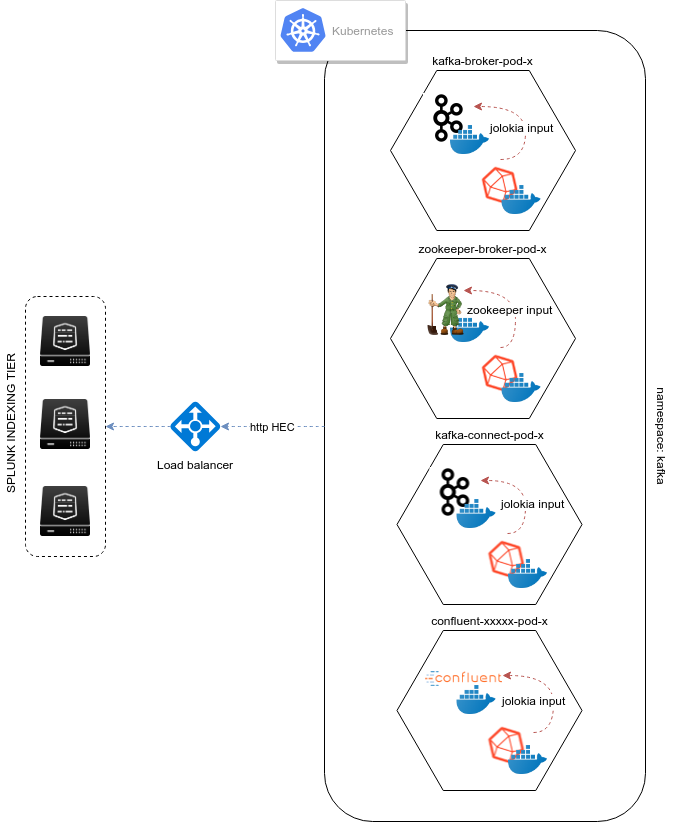

Chapter 2: Metrics
##################

Monitoring Kafka in dedicated servers (bare metal, VMs)
*******************************************************

.. image:: img/dedicated-server.png
   :alt: dedicated-server.png
   :align: center

**Dedicated servers are bare metal servers or virtual machines that are dedicated to host one or more Kafka roles.**

Deploying Jolokia
=================

.. image:: img/jolokia_logo.png
   :alt: jolokia_logo.png
   :align: center

**The first requirement is the deployment of Jolokia to your Kafka components:**

* Apache Kafka Brokers
* Apache Kafka Connect
* Confluent schema-registry
* Confluent ksql-server
* Confluent kafka-rest

*Notes: Jolokia does not need to be deployed to your Zookeeper nodes as we use the Telegraph Zookeeper input.*

Jolokia is a very simple and efficient JVM agent to deployed to the components, it can be started by attaching to the JVM process on the flight, or automatically at JVM startup by using the javaagent argument.

For more information about Jolokia: https://jolokia.org

- Download the latest Jolokia JVM agent jar file: https://jolokia.org/reference/html/agents.html#agents-jvm

- Upload the jar file to each of your servers, this documentation assumes the agent will be available in ``/opt/jolokia/``, example:

::

    /opt/jolokia/jolokia.jar

- Modify the systemd service file to configure the ``-javaagent`` argument.

*Notes:*

- Choose one TCP port per Jolokia instance
- Choose if you want to allow Jolokia to listen on any interfaces (``host=0.0.0.0``) or restricted to a specific interface (depending how you collect, see later on the documentation)
- More options are available, see https://jolokia.org/reference/html/agents.html

Kafka brokers
=============

**Configuring the systemd service file:**

- Edit: ``/lib/systemd/system/confluent-kafka.service``

- Add ``-javaagent`` argument:

::

    [Unit]
    Description=Apache Kafka - broker
    Documentation=http://docs.confluent.io/
    After=network.target confluent-zookeeper.target

    [Service]
    Type=simple
    User=cp-kafka
    Group=confluent
    ExecStart=/usr/bin/kafka-server-start /etc/kafka/server.properties
    Environment="KAFKA_OPTS=-javaagent:/opt/jolokia/jolokia.jar=port=8778,host=0.0.0.0"
    TimeoutStopSec=180
    Restart=no

    [Install]
    WantedBy=multi-user.target

- Reload systemd and restart:

::

    sudo systemctl daemon-restart
    sudo systemctl restart confluent-kafka

Kafka Connect
=============

**Configuring the systemd service file:**

- Edit: ``/lib/systemd/system/confluent-kafka-connect.service``

- Add ``-javaagent`` argument:

::

    [Unit]
    Description=Apache Kafka Connect - distributed
    Documentation=http://docs.confluent.io/
    After=network.target confluent-kafka.target

    [Service]
    Type=simple
    User=cp-kafka-connect
    Group=confluent
    ExecStart=/usr/bin/connect-distributed /etc/kafka/connect-distributed.properties
    Environment="KAFKA_OPTS=-javaagent:/opt/jolokia/jolokia.jar=port=8778,host=0.0.0.0"
    Environment="LOG_DIR=/var/log/connect"
    TimeoutStopSec=180
    Restart=no

    [Install]
    WantedBy=multi-user.target

- Reload systemd and restart:

::

    sudo systemctl daemon-restart
    sudo systemctl restart confluent-kafka-connect

Schema registry
===============

**Configuring the systemd service file:**

- Edit: ``/lib/systemd/system/confluent-schema-registry.service``

- Add ``-javaagent`` argument:

::

    [Unit]
    Description=RESTful Avro schema registry for Apache Kafka
    Documentation=http://docs.confluent.io/
    After=network.target confluent-kafka.target

    [Service]
    Type=simple
    User=cp-schema-registry
    Group=confluent
    Environment="LOG_DIR=/var/log/confluent/schema-registry"
    Environment="SCHEMA_REGISTRY_OPTS=-javaagent:/opt/jolokia/jolokia.jar=port=8778,host=0.0.0.0"
    ExecStart=/usr/bin/schema-registry-start /etc/schema-registry/schema-registry.properties
    TimeoutStopSec=180
    Restart=no

    [Install]
    WantedBy=multi-user.target

- Reload systemd and restart:

::

    sudo systemctl daemon-restart
    sudo systemctl restart confluent-schema-registry

ksql-server
===========

**Configuring the systemd service file:**

- Edit: ``/lib/systemd/system/confluent-ksql.service``

- Add ``-javaagent`` argument:

::

    [Unit]
    Description=Streaming SQL engine for Apache Kafka
    Documentation=http://docs.confluent.io/
    After=network.target confluent-kafka.target confluent-schema-registry.target

    [Service]
    Type=simple
    User=cp-ksql
    Group=confluent
    Environment="LOG_DIR=/var/log/confluent/ksql"
    Environment="KSQL_OPTS=-javaagent:/opt/jolokia/jolokia.jar=port=8778,host=0.0.0.0"
    ExecStart=/usr/bin/ksql-server-start /etc/ksql/ksql-server.properties
    TimeoutStopSec=180
    Restart=no

    [Install]
    WantedBy=multi-user.target

- Reload systemd and restart:

::

    sudo systemctl daemon-restart
    sudo systemctl restart confluent-ksql

kafka-rest
==========

**Configuring the systemd service file:**

- Edit: ``/lib/systemd/system/confluent-kafka-rest.service``

- Add ``-javaagent`` argument:

::

    [Unit]
    Description=A REST proxy for Apache Kafka
    Documentation=http://docs.confluent.io/
    After=network.target confluent-kafka.target

    [Service]
    Type=simple
    User=cp-kafka-rest
    Group=confluent
    Environment="LOG_DIR=/var/log/confluent/kafka-rest"
    Environment="KAFKAREST_OPTS=-javaagent:/opt/jolokia/jolokia.jar=port=8778,host=0.0.0.0"

    ExecStart=/usr/bin/kafka-rest-start /etc/kafka-rest/kafka-rest.properties
    TimeoutStopSec=180
    Restart=no

    [Install]
    WantedBy=multi-user.target

- Reload systemd and restart:

::

    sudo systemctl daemon-restart
    sudo systemctl restart confluent-kafka-rest

Monitoring Kafka in Kubernetes
******************************

.. image:: img/kubernetes-logo.png
   :alt: kubernetes-logo.png
   :align: center

**For the ease of documentation, this guide assumes you are deploying containers with Kubernetes and Docker, although these instructions can transposed to other containers orchestrator solutions.**

**3 main steps for implementation:**

1. Deploying Jolokia jar agent
2. Configuring the containers to start with Jolokia
3. Deploying the Telegraf containers

*metrics collection diagram - sidecar containers:*

Deploying Jolokia
=================

.. image:: img/jolokia_logo.png
   :alt: jolokia_logo.png
   :align: center

**The Jolokia agent jar file needs to be available to the pods, you have different possibilities:**

- Starting Kubernetes 1.10.0, you can store a binary file in a configMap. As such, it is very easy to load the Jolokia jar file and make it available to your pods. (**recommended approach**)

- For prior versions, you can automatically mount a persistent volume on the pods such as an NFS volume or a Cloud provider volume that will make the Jolokia jar available to your pods.

- uploading the jar file on every node and mounting a local persistent volume (requires each node to have the jolokia jar uploaded manually)

**To download the latest version of Jolokia:** https://jolokia.org/reference/html/agents.html#agents-jvm

Option 1: Jolokia jar in configMap
----------------------------------

**See the files in Github:**

https://github.com/guilhemmarchand/splunk-guide-for-kafka-monitoring/tree/master/kubernetes-yaml-examples/Jolokia

**From your management server where kubectl is configured, download the latest Jolokia jar file:**

::

    curl http://search.maven.org/remotecontent?filepath=org/jolokia/jolokia-jvm/1.6.0/jolokia-jvm-1.6.0-agent.jar -o jolokia.jar

**Create a configMap from the binary file:**

::

    kubectl create configmap jolokia-jar --from-file=jolokia.jar

**From the configMap, optionally create the yml file:**

::

    kubectl get configmaps jolokia-jar -o yaml --export > 01-jolokia-jar-configmap.yml

**If you need your configMap to be associated with a name space, simply edit the end of the file and add your name space Metadata:**

::

    metadata:
      name: jolokia-jar
      namespace: kafka

**Modify your definitions to include the volume:**

::

    spec:
      volumes:
        - name: jolokia-jar
          configMap:
            name: jolokia-jar
      containers:
        - name: xxxxx
          image: xxxx
          volumeMounts:
            - mountPath: "/opt/jolokia"
              name: jolokia-jar

**Finally, update the environment variable to start Jolokia (see next steps) and apply.**

Option 2: NFS persistent volume configuration example
-----------------------------------------------------

**Ensure all the nodes have the nfs-common package installed:**

*For Ubuntu & Debian:*

::

    sudo apt-get -y install nfs-common

*For RHEL, Centos and derivated:*

::

    sudo yum -y install nfs-common

**Upload the jar file to your NFS server, and create a share that will be used automatically by the pods, example:**

::

    /export/jolokia/jolokia-jvm-1.6.0-agent.jar

**Have your share configured in /etc/exports:**

::

    /export/jolokia/ *(ro,sync,no_root_squash,subtree_check)

**Refresh exports:**

::

    sudo exportfs -ra

**Create a Kubernetes PersistentVolume:**

*pv-jolokia.yaml*

::

    kind: PersistentVolume
    apiVersion: v1
    metadata:
      name: pv-jolokia
      labels:
        type: jolokia
    spec:
      storageClassName: generic
      capacity:
        storage: 100Mi
      accessModes:
        - ReadOnlyMany
      persistentVolumeReclaimPolicy: Retain
      nfs:
        path: /export/jolokia
        server: <NFS server address>
        readOnly: true

*pvc-jolokia.yaml:**

::

    apiVersion: v1
    kind: PersistentVolumeClaim
    metadata:
      name: pvc-jolokia
    spec:
      storageClassName: generic
      accessModes:
      - ReadOnlyMany
      resources:
        requests:
          storage: 100Mi
      selector:
        matchLabels:
          type: jolokia

**When you will start your pods, you will specify the PersistentVolumeClaim and the mount options to get Jolokia available on the pods:**

::

    kind: Pod
    apiVersion: v1
    metadata:
      name: xxxxx
    spec:
      volumes:
        - name: pv-jolokia
          persistentVolumeClaim:
           claimName: pvc-jolokia
      containers:
        - name: xxxxx
          image: xxxx
          volumeMounts:
            - mountPath: "/opt/jolokia"
              name: pv-jolokia

Option 3: Local persistent volume configuration example
-------------------------------------------------------

**Upload the jar file to each of Kubernetes node, this documentation assumes the agent will be available in /opt/jolokia/, example:**

::

    /opt/jolokia/jolokia-jvm-1.6.0-agent.jar

**Create a Kubernetes PersistentVolume:**

*pv-jolokia.yaml*

::

    kind: PersistentVolume
    apiVersion: v1
    metadata:
      name: pv-jolokia
      labels:
        type: jolokia
    spec:
      storageClassName: generic
      capacity:
        storage: 100Mi
      accessModes:
        - ReadOnlyMany
      persistentVolumeReclaimPolicy: Retain
      hostPath:
        path: "/opt/jolokia"

**Create:**

::

    kubectl create -f pv-jolokia.yaml

**Create a PersistentVolumeClaim to be used by the pods definition:**

*pvc-jolokia.yaml:**

::

        apiVersion: v1
        kind: PersistentVolumeClaim
        metadata:
          name: pvc-jolokia
        spec:
          storageClassName: generic
          accessModes:
          - ReadOnlyMany
          resources:
            requests:
              storage: 100Mi
          selector:
            matchLabels:
              type: jolokia

**When you will start your pods, you will specify the PersistentVolumeClaim and the mount options to get Jolokia available on the pods:**

::

    kind: Pod
    apiVersion: v1
    metadata:
      name: xxxxx
    spec:
      volumes:
        - name: pv-jolokia
          persistentVolumeClaim:
           claimName: pvc-jolokia
      containers:
        - name: xxxxx
          image: xxxx
          volumeMounts:
            - mountPath: "/opt/jolokia"
              name: pv-jolokia

Starting Jolokia with container startup
=======================================

Kafka brokers
-------------

**Modify your pod definition:**

::

    spec:
      containers:
      - name: xxxxxx
        image: xxxxxx:latest
        env:
        - name: KAFKA_OPTS
          value: "-javaagent:/opt/jolokia/jolokia.jar=port=8778,host=0.0.0.0"

**You can use the patch method to update your existing pod definition:**

https://github.com/guilhemmarchand/splunk-guide-for-kafka-monitoring/tree/master/kubernetes-yaml-examples/zookeeper

Kafka Connect
-------------

**Modify your pod definition:**

::

    spec:
      containers:
      - name: xxxxxx
        image: xxxxxx:latest
        env:
        - name: KAFKA_OPTS
          value: "-javaagent:/opt/jolokia/jolokia.jar=port=8778,host=0.0.0.0"

**You can use the patch method to update your existing pod definition:**

https://github.com/guilhemmarchand/splunk-guide-for-kafka-monitoring/tree/master/kubernetes-yaml-examples/kafka-connect

Schema registry
---------------

**Modify your pod definition:**

::

    spec:
      containers:
      - name: xxxxxx
        image: xxxxxx:latest
        env:
        - name: SCHEMA_REGISTRY_OPTS
          value: "-javaagent:/opt/jolokia/jolokia.jar=port=8778,host=0.0.0.0"

**You can use the patch method to update your existing pod definition:**

https://github.com/guilhemmarchand/splunk-guide-for-kafka-monitoring/tree/master/kubernetes-yaml-examples/confluent-schema-registry

ksql-server
-----------

**Modify your pod definition:**

::

    spec:
      containers:
      - name: xxxxxx
        image: xxxxxx:latest
        env:
        - name: KSQL_OPTS
          value: "-javaagent:/opt/jolokia/jolokia.jar=port=8778,host=0.0.0.0"

**You can use the patch method to update your existing pod definition:**

https://github.com/guilhemmarchand/splunk-guide-for-kafka-monitoring/tree/master/kubernetes-yaml-examples/confluent-ksql-server

kafka-rest
----------

**Modify your pod definition:**

::

    spec:
      containers:
      - name: xxxxxx
        image: xxxxxx:latest
        env:
        - name: KAFKAREST_OPTS
          value: "-javaagent:/opt/jolokia/jolokia.jar=port=8778,host=0.0.0.0"

**You can use the patch method to update your existing pod definition:**

https://github.com/guilhemmarchand/splunk-guide-for-kafka-monitoring/tree/master/kubernetes-yaml-examples/confluent-kafka-rest

Monitoring the components metrics with Telegraf
===============================================

.. image:: img/telegraf-logo.png
   :alt: telegraf-logo.png
   :align: center

**Telegraf is a very efficient plugin driven agent collector, in the context of Kubernetes there are several design choices possible:**

- Running Telegraf agent as a container in the same pod than the JVM container, called a sidecar container. (recommended approach)
- Running Telegraf agent as a deployment with 1 replica, accessing all JVMs instances via cluster exposed services (one or more deployments if you want to specialise per role, or something else)

Both designs are pertinents, however running collector agents as sidecar containers provides valuable advantages such as ensuring that the collector container will always run on the same node and it is not required to expose any endpoint.

In addition, this is an easy "build and forget" approach, each container monitors the local JVM container automatically, following the same rhythm of destruction and creation.

**When running Telegraf as a sidecar container, an additional container will be running in the same pod, generally associated with a StatefulSet or Deployment.**

Zookeeper monitoring
--------------------

Link: `Zookeeper metrics`_

.. _Zookeeper metrics: https://github.com/guilhemmarchand/splunk-guide-for-kafka-monitoring/tree/master/kubernetes-yaml-examples/zookeeper/02-metrics

Kafka Brokers monitoring
------------------------

Link: `Kafka Brokers metrics`_

.. _Kafka Brokers metrics: https://github.com/guilhemmarchand/splunk-guide-for-kafka-monitoring/tree/master/kubernetes-yaml-examples/kafka-brokers/02-metrics

Kafka Connect monitoring
------------------------

Link: `Kafka Connect metrics`_

.. _Kafka Connect metrics: https://github.com/guilhemmarchand/splunk-guide-for-kafka-monitoring/tree/master/kubernetes-yaml-examples/kafka-connect/02-metrics

Confluent schema-registry monitoring
------------------------------------

Link: `Confluent shema-registry metrics`_

.. _Confluent shema-registry metrics: https://github.com/guilhemmarchand/splunk-guide-for-kafka-monitoring/tree/master/kubernetes-yaml-examples/confluent-schema-registry/02-metrics

Confluent kafka-rest monitoring
-------------------------------

Link: `Confluent kafka-rest metrics`_

.. _Confluent kafka-rest metrics: https://github.com/guilhemmarchand/splunk-guide-for-kafka-monitoring/tree/master/kubernetes-yaml-examples/confluent-kafka-rest/02-metrics

Confluent ksql-server monitoring
--------------------------------

Link: `Confluent ksql-server metrics`_

.. _Confluent ksql-server metrics: https://github.com/guilhemmarchand/splunk-guide-for-kafka-monitoring/tree/master/kubernetes-yaml-examples/confluent-ksql-server/02-metrics
