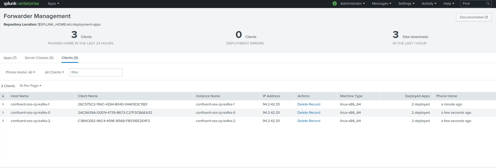

# Splunk Universal Forwarder sidecar container for Confluent kafka-rest events logging in a Kubernetes deployment

--------------------------------------------------------------------------------

This configuration guide assumes that you have a Splunk Deployment Server (DS) that the Splunk Universal Forwarders sidecar containers will contact to retrieve its configuration such as inputs and outputs.

Running the Splunk Universal Forwarder in a sidecar container is the most powerful configuration providing all the features from Splunk and Kubernetes.

The containers automatically share a volume where logs are being created by kafka-rest, and read by Splunk.

### Step 1: (Splunk secrets and configMap)

- Ensure you have created a secrets to reference the Splunk admin password:

*Convert the Splunk admin password in base64 value:*

```
echo -n "ch@ngeM3" | base64
Y2hAbmdlTTMK=
```

*Update your secrets yaml file: ../../yaml_git_ignored/global-splunk-uf-secrets.yml:*

```
apiVersion: v1
kind: Secret
metadata:
  name: global-splunk-uf-secrets
  namespace: kafka
type: Opaque
data:
  splunk_password: Y2hAbmdlTTMK=
```

*Create:*

```
kubectl create -f ../../yaml_git_ignored/global-splunk-uf-secrets.yml
```

- Ensure you have created a configMap to reference the Splunk deployment server URL:

*../../yaml_git_ignored/global-splunk-uf-config.yml:*

```
apiVersion: v1
kind: ConfigMap
metadata:
  namespace: kafka
  name: global-splunk-uf-config
data:
  splunk_deployment_server: "my-splunk-ds-url.domain.com"
  splunk_s2s_port: "8089"
```

*Create:*

```
kubectl create -f ../../yaml_git_ignored/global-splunk-uf-config.yml
```

--------------------------------------------------------------------------------

### Step 2: (log4j configMap)

*Create:*

```
kubectl create -f 02-confluent-kafka-rest-log4j-configmap.yml

```

--------------------------------------------------------------------------------

### Step 3: (patch)

The patch will update your kafka-rest Deployment and create the Splunk Universal Forwarder sidecar container.

- Update the file 03-patch-shared-volume-and-splunk-uf.yml to match the name of your Deployment

*This part must be changed to match the name of your Deployment:*

```
metadata:
  name: confluent-oss-cp-kafka-rest
```

*This part must be changed to match the name of the container:*

```
      containers:
      - name: cp-kafka-rest-server
```

- Run the patch command and ensure you specify the name of your Deployment:

```
kubectl --namespace kafka patch deployment confluent-oss-cp-kafka-rest --patch "$(cat 03-patch-shared-volume-and-splunk-uf.yml )"
```

--------------------------------------------------------------------------------

### Step 4: (Splunk)

Once the Splunk UF containers will have been started, the containers will be connected to your Splunk Deployment Server.



Create a Splunk Application containing the following configuration:

```
TA-confluent-kafka-rest/
                       local/
                            inputs.conf
                            props.conf
```

*inputs.conf*

```
[monitor:///var/log/kafka/kafka-rest.log]
disabled = false
index = kafka
sourcetype = kafka:kafka-rest

[monitor:///var/log/kafka/*-gc.log*.current]
disabled = false
index = kafka
sourcetype = kafka:kafka-rest:gc-log
```

*props.conf*

```
[kafka:kafka-rest]
EVENT_BREAKER_ENABLE=true
EVENT_BREAKER=([\n\r]+)\[\d{4}-\d{2}-\d{2}\s\d{2}:\d{2}:\d{2}\,\d{3}\]
```

Deploy this Splunk application to the containers, and events logging magic will start.

--------------------------------------------------------------------------------

**To troubleshoot, useful kubectl commands:**

```
kubectl -n kafka describe deployments.apps confluent-oss-cp-kafka-rest
kubectl -n kafka get po
kubectl -n kafka describe po confluent-oss-cp-kafka-rest-79dbfcf47d-vr44c
kubectl -n kafka logs confluent-oss-cp-kafka-rest-79dbfcf47d-vr44c -c splunk
kubectl -n kafka logs confluent-oss-cp-kafka-rest-79dbfcf47d-vr44c -c cp-kafka-rest-server
kubectl -n kafka exec -it confluent-oss-cp-kafka-rest-79dbfcf47d-vr44c /bin/bash -c cp-kafka-rest-server
```

--------------
[Go back](../)