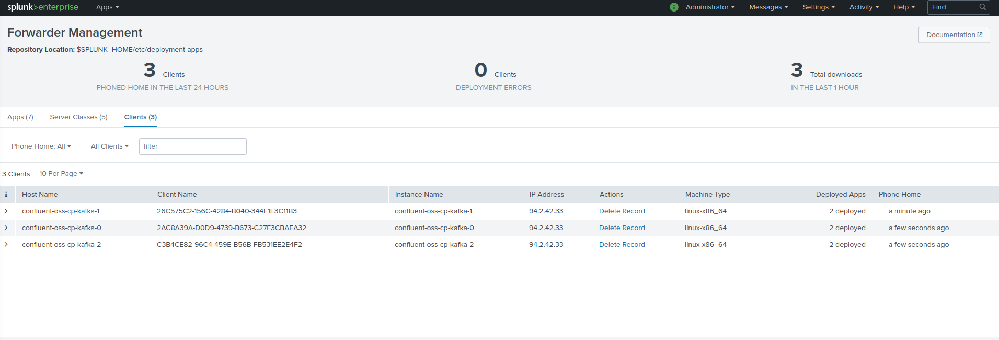

# Splunk Universal Forwarder sidecar container to monitor events logging of Kafka brokers in a Kubernetes statefulSet

--------------------------------------------------------------------------------

This configuration guide assumes that you have a Splunk Deployment Server (DS) that the Splunk Universal Forwarders sidecar containers will contact to retrieve its configuration such as inputs and outputs.

Running the Splunk Universal Forwarder in a sidecar container is the most powerful configuration providing all the features from Splunk and Kubernetes.

The containers automatically share a volume where logs are being created by Kafka, and read by Splunk.

### Step 1: (Splunk secrets and configMap)

- Ensure you have created a secrets to reference the Splunk admin password:

*Convert the Splunk admin password in base64 value:*

```
echo "ch@ngeM3" | base64
Y2hAbmdlTTMK
```

*Update your secrets yaml file: ../../yaml_git_ignored/global-splunk-uf-secrets.yml:*

```
apiVersion: v1
kind: Secret
metadata:
  name: splunk-secrets
  namespace: kafka
type: Opaque
data:
  splunk_password: Y2hAbmdlTTMK
```

*Create:*

```
kubectl create -f ../../yaml_git_ignored/global-splunk-uf-secrets.yml
```

- Ensure you have created a configMap to reference the Splunk deployment server URL:

*../yaml_git_ignored/global-splunk-uf-config.yml:*

```
apiVersion: v1
kind: ConfigMap
metadata:
  namespace: kafka
  name: global-splunk-uf-config
data:
  splunk_deployment_server: "my-splunk-ds-url.amazonaws.com"
  splunk_s2s_port: "8089"
```

*Create:*

```
kubectl create -f ../../yaml_git_ignored/global-splunk-uf-config.yml
```

--------------------------------------------------------------------------------

### Step 2: (KAFKA_OPTS configMap)

*Create:*

```
kubectl create -f 02-kafka-brokers-opts-configmap.yml
```

--------------------------------------------------------------------------------

### Step 3: (log4j configMap)

*Create:*

```
kubectl create -f 03-kafka-brokers-log4j-configmap.yml

```

--------------------------------------------------------------------------------

### Step 4: (patch)

The patch will update your Kafka broker statefulSet deployment and create the Splunk Universal Forwarder sidecar container.

- Update the file 04-patch-shared-volume-and-splunk-uf.yml to match the name of your statefulSet deployment

*This part must be changed to match the name of your statefulSet deployment:*

```
metadata:
  name: confluent-oss-cp-kafka
```

- Run the patch command and ensure you specify the name of your statefulSet deployment:

```
kubectl --namespace kafka patch statefulset confluent-oss-cp-kafka --patch "$(cat 04-patch-shared-volume-and-splunk-uf.yml )"
```

--------------------------------------------------------------------------------

### Step 5: (Splunk)

Once the Splunk UF containers will have been started, the containers will be connected to your Splunk Deployment Server.



Create a Splunk Application containing the following configuration:

```
TA-kafka-brokers/
                 local/
                       inputs.conf
                       props.conf
```

*inputs.conf*

```
[monitor:///var/log/kafka/controller.log]
disabled = false
index = kafka
sourcetype = kafka:broker:controller

[monitor:///var/log/kafka/server.log]
disabled = false
index = kafka
sourcetype = kafka:broker:server

[monitor:///var/log/kafka/state-change.log]
disabled = false
index = kafka
sourcetype = kafka:broker:state-change

[monitor:///var/log/kafka/log-cleaner.log]
disabled = false
index = kafka
sourcetype = kafka:broker:log-cleaner

[monitor:///var/log/kafka/kafka-request.log]
disabled = false
index = kafka
sourcetype = kafka:broker:kafka-request

[monitor:///var/log/kafka/kafka-authorizer.log]
disabled = fale
index = kafka
sourcetype = kafka:broker:kafka-authorizer

[monitor:///var/log/kafka/*-gc.log*.current]
disabled = fale
index = kafka
sourcetype = kafka:broker:gc-log
```

*props.conf*

```
[kafka:broker:controller]
EVENT_BREAKER_ENABLE=true
EVENT_BREAKER=([\n\r]+)\[\d{4}-\d{2}-\d{2}\s\d{2}:\d{2}:\d{2}\,\d{3}\]

[kafka:broker:server]
EVENT_BREAKER_ENABLE=true
EVENT_BREAKER=([\n\r]+)\[\d{4}-\d{2}-\d{2}\s\d{2}:\d{2}:\d{2}\,\d{3}\]

[kafka:broker:state-change]
EVENT_BREAKER_ENABLE=true
EVENT_BREAKER=([\n\r]+)\[\d{4}-\d{2}-\d{2}\s\d{2}:\d{2}:\d{2}\,\d{3}\]

[kafka:broker:log-cleaner]
EVENT_BREAKER_ENABLE=true
EVENT_BREAKER=([\n\r]+)\[\d{4}-\d{2}-\d{2}\s\d{2}:\d{2}:\d{2}\,\d{3}\]

[kafka:broker:kafka-request]
EVENT_BREAKER_ENABLE=true
EVENT_BREAKER=([\n\r]+)\[\d{4}-\d{2}-\d{2}\s\d{2}:\d{2}:\d{2}\,\d{3}\]

[kafka:broker:kafka-authorizer]
EVENT_BREAKER_ENABLE=true
EVENT_BREAKER=([\n\r]+)\[\d{4}-\d{2}-\d{2}\s\d{2}:\d{2}:\d{2}\,\d{3}\]
```

Deploy this Splunk application to the containers, and events logging magic will start.

--------------------------------------------------------------------------------

**To troubleshoot, useful kubectl commands:**

```
kubectl -n kafka describe statefulSet.apps confluent-oss-cp-kafka
kubectl -n kafka get po
kubectl -n kafka describe po confluent-oss-cp-kafka-0
kubectl -n kafka logs confluent-oss-cp-kafka-0 -c splunk
kubectl -n kafka logs confluent-oss-cp-kafka-0 -c cp-kafka-broker
```

--------------
[Go back](../)